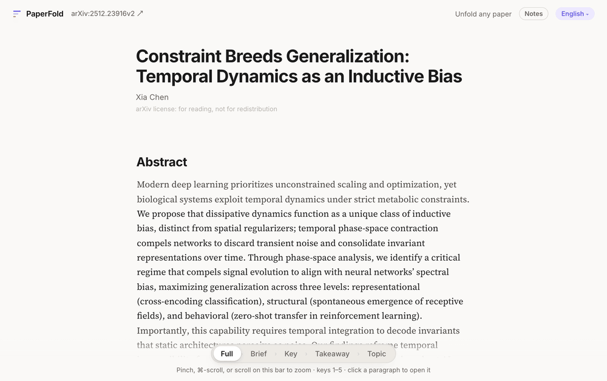

<div align="center">


# PaperFold

**Zoom any paper for your better understanding**


<a href="LICENSE"></a>

**English** · [简体中文](README.zh-CN.md)

**[Try it →](https://chenxiachan.github.io/paperfold-gallery/)** papers from different fields, nothing to install.

<br>



</div>

## Read with less in your head

A paper asks you to hold its whole argument in mind while you read it one paragraph at a time. PaperFold holds the argument for you. Fold the paper to see how its sections build on each other, unfold the part you care about, and the sentence you were reading never leaves the screen.

| | Level | Each paragraph becomes | In whose words |
|:-:|---|---|---|
| **1** | **Full** | the paragraph as written | the authors' |
| **2** | **Brief** | its one to three key sentences, verbatim | the authors' |
| **3** | **Key** | its point and the reason for it | AI |
| **4** | **Takeaway** | one line on the spine of its section | AI |
| **5** | **Topic** | a few words; the paper becomes a map of section cards | AI |

## What you get

- **Words that travel.** As you zoom, every word that stays slides to its new place and the rest fade around it.
- **Zoom under your fingers.** Pinch, ⌘-scroll or drag the level bar. Stop halfway, turn back, or open one paragraph alone.
- **Always know who is speaking.** The authors' words are set in a serif and AI's in a sans serif. Each paragraph is colored by its role in the argument.
- **Ask, and see the evidence.** Ask about a passage or about the whole paper. Every answer cites the paragraphs it rests on, one click away.
- **Notes that zoom with the paper.** Highlight and write in the margin, and what you marked stays as you zoom out. Export to Obsidian, PDF or JSON.
- **Your language.** Twelve languages, translated sentence by sentence, with every formula as typeset.

<table>
<tr>
<td width="50%"></td>
<td width="50%"></td>
</tr>
<tr>
<td align="center"><sub>Highlight and write in the margin…</sub></td>
<td align="center"><sub>…and keep what you marked as you zoom out.</sub></td>
</tr>
</table>

## Get started

```bash
git clone https://github.com/chenxiachan/paperfold.git
cd paperfold
python3 -m pip install -r requirements.txt
python3 -m adr serve
```

Open `http://localhost:3017`, which the last command prints. The first time, [connect a model](#connect-a-model); then paste an arXiv link and pick a language.

You need Python 3.9 or newer (the one macOS ships with works), and a paper with an arXiv HTML version, as most papers since late 2023 have.

## Connect a model

PaperFold uses a model you already have, and there is no account to create. It looks for one when it starts; if it finds none, the first page offers the ways in.

| You have | What to do |
|---|---|
| Claude Code, Codex or Pi | Nothing. PaperFold finds it and uses it. |
| A ChatGPT plan | Click **Use my ChatGPT plan**. A small bridge starts on your computer and signs in with your account (needs Node.js). |
| Nothing yet | Click **OpenRouter in one click**. Authorize once, and free models are ready. |
| An API key | **Settings › Add provider**: Anthropic, OpenAI, DeepSeek, Qwen, Zhipu GLM, Kimi, MiniMax, Google, Ollama, or any OpenAI-compatible endpoint. |

## In the reader

| Do | To |
|---|---|
| Pinch, or ⌘ / Ctrl + scroll | zoom around the pointer |
| `1` to `5` | jump to a level |
| Click a paragraph | open just that paragraph |
| Select text | highlight, write a note, or ask |
| **Ask the paper**, bottom right | ask about the whole paper |
| `L` | next language |

## Share a paper

```bash
python3 -m adr export 2201.11903
```

This writes one self-contained HTML file to `out/2201.11903/` that opens anywhere without a server. PaperFold's license covers its code: a paper, and the levels and translations made from it, stay under the license its authors chose, shown under every title. Most arXiv papers allow reading but not redistribution, so share a page only when that license allows it, as Creative Commons licenses do.

<br>

<div align="center">

**If PaperFold makes papers easier to read, ⭐ star it so others can find it.**

</div>

---

<div align="center">

[Apache 2.0](./LICENSE) © 2026 Xia Chen · [Development](docs/DEVELOPMENT.md) · [Feedback](https://github.com/chenxiachan/paperfold/issues)

</div>
