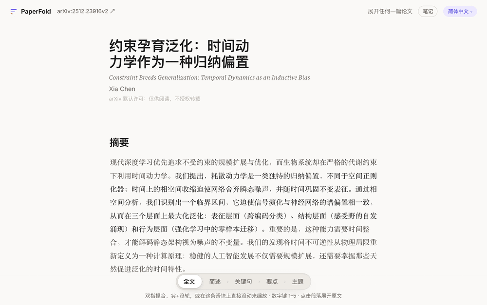
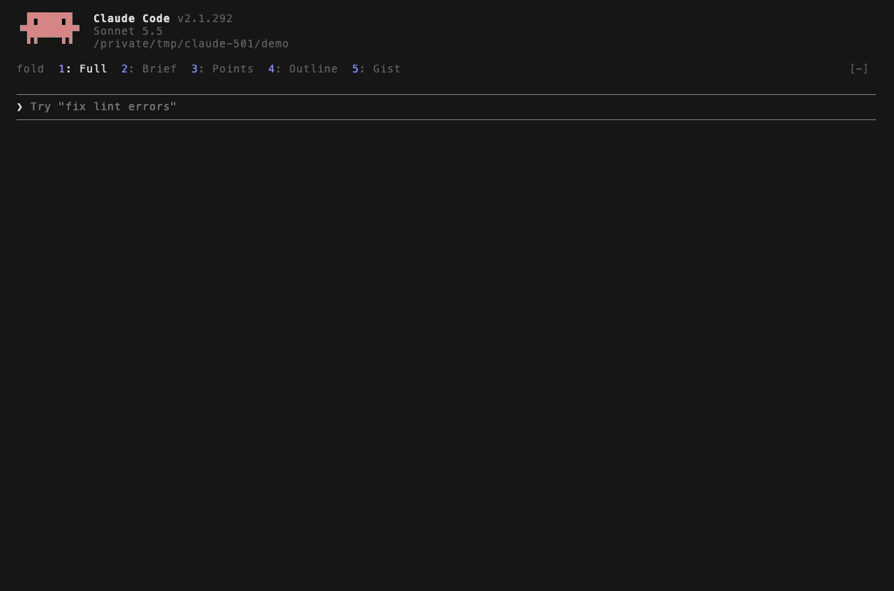
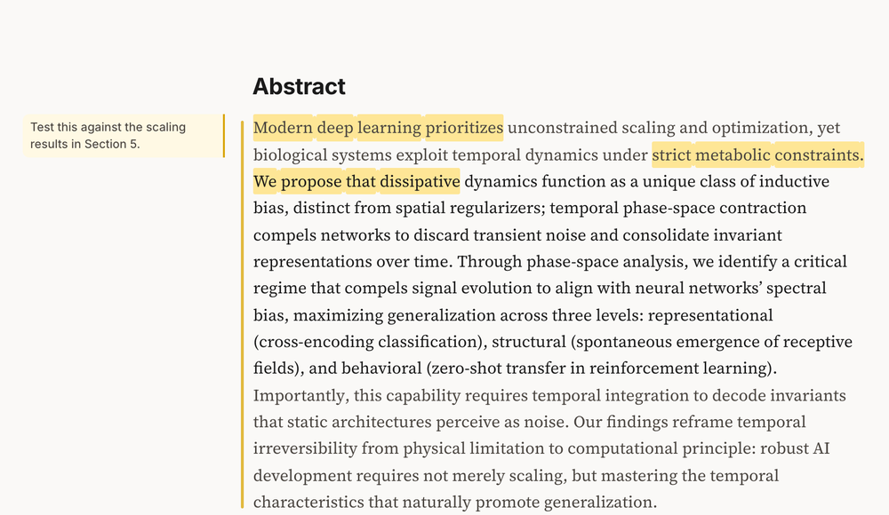
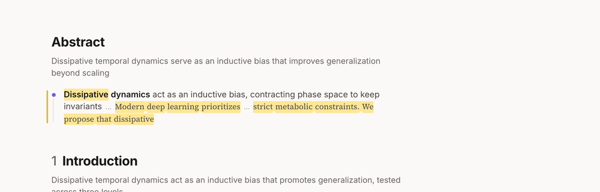

<div align="center">


# PaperFold

**缩放任何文字，读得更明白**


<a href="LICENSE"></a>

[English](README.md) · **简体中文**

**[试一试效果 →](https://chenxiachan.github.io/paperfold-gallery/)** 来自不同领域的arXiv论文，无需安装。

<br>



<br><br>

### 也可以用在 Agent 输出上

Agent 写的，总比你有空读的多。一个 [Claude Code mod](https://code.claude.com/docs/en/plugins/mods/overview) 用同样的方式折叠每条回答，一个键一个层级。[了解更多 ↓](#在-claude-code-里)



</div>

## 最新

- **2026 年 10 月：Agent 的回答也能折叠了。** [TextFold](#在-claude-code-里) 把五个层级放到 Claude Code 的每条回答上。按 5 看一句话的答案，按 1 看每一个字。
- **2026 年 10 月：不只读 arXiv。** 粘贴 PubMed Central、bioRxiv、medRxiv 上论文的链接或 DOI，或任何语言的维基百科条目，也可以拖入你自己的 Markdown 文件。打开后同样是五个层级。

## 读论文，脑子里少装一点

读论文时，你得一段一段地往下读，同时在脑子里撑住整篇的论证。PaperFold 替你撑住它：折起来，看清各节怎样一步步推进；在关心的地方展开；你正在读的那句话始终留在屏幕上。

| | 层级 | 每一段变成 | 谁的话 |
|:-:|---|---|---|
| **1** | **全文** | 原样的段落 | 作者 |
| **2** | **简述** | 一到三句关键原句，一字不改 | 作者 |
| **3** | **关键句** | 这一段的要点和理由 | AI |
| **4** | **要点** | 一行，挂在本节的主线上 | AI |
| **5** | **主题** | 几个词；整篇论文变成一张章节卡片地图 | AI |

## 你会得到

- **词会移动，不会被换掉。** 缩放时，留下的词滑到新的位置，其余的在周围淡出。
- **缩放跟着手指走。** 双指捏合、⌘ 加滚轮或拖动层级条。可以停在半路、往回退，也可以只展开一段。
- **始终知道是谁在说话。** 作者的原话用衬线体，AI 写的用无衬线体。每一段还按它在论证中的作用标了颜色。
- **能追问，也能看到依据。** 可以就一段话或整篇论文提问。每个回答都标出依据的段落，点一下就到。
- **笔记跟着论文缩放。** 在页边高光、写笔记，缩小时标过的内容依然在。可以导出到 Obsidian、PDF 或 JSON。
- **用你的语言读。** 十二种语言，逐句翻译，公式保持原样。

<table>
<tr>
<td width="50%"></td>
<td width="50%"></td>
</tr>
<tr>
<td align="center"><sub>在全文里高光、在页边写笔记……</sub></td>
<td align="center"><sub>……缩小时，标过的内容依然在。</sub></td>
</tr>
</table>

## 开始使用

```bash
git clone https://github.com/chenxiachan/paperfold.git
cd paperfold
python3 -m pip install -r requirements.txt
python3 -m adr serve
```

在浏览器里打开 `http://localhost:3017`（最后一条命令会打印这个地址）。第一次使用先[连接一个模型](#连接模型)，然后粘贴 arXiv、PubMed Central、bioRxiv、medRxiv 上论文的链接或 DOI，或维基百科条目，也可以拖入一个 Markdown 文件，再选择语言。

需要 Python 3.9 或更新的版本（macOS 自带的就可以）。arXiv 论文要有 arXiv 生成的 HTML 版本，2023 年底以来的论文大多都有；bioRxiv 和 medRxiv 的预印本、任何语言的维基百科条目，都直接从网站读取；其他论文要在 [Europe PMC](https://europepmc.org) 有开放全文（PubMed Central 的开放获取文章，以及 Research Square 等平台的预印本）；Markdown 文件没有这个要求。

## 连接模型

PaperFold 用你已有的模型，不需要注册账号。启动时它会自己去找；一个都没找到时，首页会给出接入的方式。

| 你有 | 怎么做 |
|---|---|
| Claude Code、Codex 或 Pi | 什么都不用做，PaperFold 会自动找到并使用。 |
| ChatGPT 订阅 | 点 **使用我的 ChatGPT 订阅**。电脑上会启动一个小的本地桥，用你的账号登录（需要 Node.js）。 |
| 什么都还没有 | 点 **OpenRouter 一键授权**。授权一次，免费模型马上可用。 |
| 一个 API key | **设置 › 添加供应商**：Anthropic、OpenAI、DeepSeek、通义千问、智谱 GLM、Kimi、MiniMax、Google、Ollama，或任何 OpenAI 兼容接口。 |

## 阅读时的操作

| 操作 | 作用 |
|---|---|
| 双指捏合，或 ⌘ / Ctrl 加滚轮 | 围绕鼠标所在处缩放 |
| `1` 到 `5` | 跳到某一层 |
| 点击某一段 | 只展开这一段 |
| 选中文字 | 高光、写笔记或追问 |
| 右下角 **问全文** | 就整篇论文提问 |
| `L` | 切换到下一种语言 |

## 分享一篇论文

```bash
python3 -m adr export 2201.11903
```

这会在 `out/2201.11903/` 里生成一个自包含的 HTML 文件，不需要服务器，在哪里都能打开。PaperFold 的许可证只管代码：论文本身，以及由它生成的各层级和译文，仍然适用作者选择的许可证，标在每篇论文的标题下方。arXiv 上多数论文只允许阅读，不允许转载，只有论文的许可证允许时（比如 Creative Commons），才把页面分享出去。

## 在 Claude Code 里

TextFold 把五个层级放到 Claude Code 的每条回答上。按 5 看一句话的答案，按 3 看每段的要点，按 1 看每一个字。不做任何改写，所以无论在哪一级，你读到的都是 Claude 的原话。

<details>
<summary><b>安装，以及每一级能看到什么</b></summary>

<br>

需要 Claude Code 2.1.287 或更新的版本，在终端里或桌面应用的 Code 标签页里都能用。

```bash
claude plugin marketplace add chenxiachan/paperfold
claude plugin install textfold@paperfold
```

| 键 | 层级 | 你看到的 |
|:-:|---|---|
| **1** | **Full** | Claude 写的每一个字 |
| **2** | **Brief** | 每个要点，连同背后的理由 |
| **3** | **Points** | 只看要点，一眼扫完 |
| **4** | **Outline** | 长回答的地图：有哪几节，每节讲了什么 |
| **5** | **Gist** | 一句话的答案 |

在提示框为空时输入数字，或者在提示框上方那一行里选一个层级。短回答保持原样：不到大约 80 个词（中文约 130 字），或者折叠后几乎不会变短的回答，总是原样显示。

**为什么折叠可信。** TextFold 请 Claude 把要点放在前面：每条回答先给答案，每段先写关键句。折叠保留的就是 Claude 放在最前面的内容。没有第二个模型，也不做摘要，所以折叠不花钱、不用等，也不会替 Claude 说它没说过的话。

详见 [plugins/textfold](plugins/textfold/README.md)。

</details>

<br>

<div align="center">

**如果 PaperFold 让读论文轻松了一些，点个 ⭐ star，让更多人看到它。**

</div>

---

<div align="center">

[Apache 2.0](./LICENSE) © 2026 Xia Chen · [开发文档](docs/DEVELOPMENT.md) · [参与贡献](CONTRIBUTING.md) · [反馈](https://github.com/chenxiachan/paperfold/issues)

</div>
